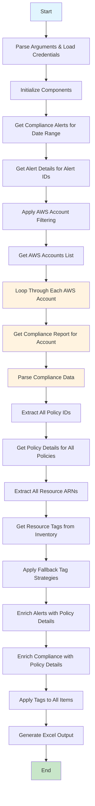

# Current Lacework Alert Reporting Flow

## Current Flow Issues for Large FortiCNP Environment:

1. **Sequential Account Processing**: Each AWS account processed one-by-one
2. **Duplicate API Calls**: Same policy/resource data fetched multiple times across accounts
3. **Memory Inefficient**: All data loaded into memory before processing
4. **No Parallelization**: No concurrent processing of accounts
5. **Tag Retrieval Bottleneck**: Tags fetched for all resources at once, causing memory/API limits
