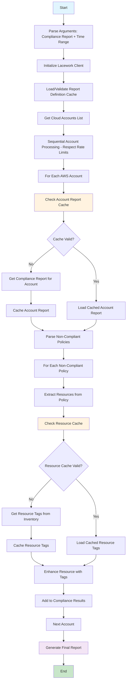

# Proposed Redesign: Compliance-Centric Architecture with Smart Caching



## Key Design Principles:

### 1. **Compliance-First Architecture**
- Start with specific compliance report (e.g., "UNSW-AWS-Cyber-Security-Standards")
- Filter to non-compliant policies only
- Extract resources only from non-compliant findings

### 2. **Rate-Limit Aware Sequential Processing**
- Process accounts sequentially to respect Lacework API rate limits
- Implement proper delays between API calls
- No parallel processing to avoid hitting rate limits

### 3. **Multi-Level Caching Strategy**
- **Report Definition Cache**: Cache compliance report definitions (rarely change)
- **Account Report Cache**: Cache full compliance reports per account per time period
- **Resource Tag Cache**: Cache resource tags with TTL based on resource type
- **Policy Cache**: Cache policy details (rarely change)

### 4. **Smart Cache Invalidation**
- Report definitions: Cache until manually cleared
- Account reports: Cache for 24 hours or until time range changes
- Resource tags: Cache for 7 days (resources don't change often)
- Policies: Cache until manually cleared

## Implementation Structure:

```
compliance_processor/
├── cache/
│   ├── report_definition_cache.py    # Cache compliance report definitions
│   ├── account_report_cache.py       # Cache account compliance reports
│   ├── resource_tag_cache.py         # Cache resource tags with TTL
│   └── policy_cache.py               # Cache policy details
├── aws/
│   ├── aws_compliance_client.py      # AWS-specific implementation
│   ├── aws_account_manager.py        # AWS account discovery
│   └── aws_resource_enhancer.py      # AWS tag retrieval
├── azure/
│   └── azure_compliance_client.py    # Future Azure implementation
└── gcp/
    └── gcp_compliance_client.py      # Future GCP implementation
```

## Caching Strategy Details:

### Cache Structure:
```
cache/
├── report-definitions/
│   └── unsw_aws_cyber_security_standards.json
├── account-reports/
│   ├── aws/
│   │   ├── 123456789012/
│   │   │   ├── 2025-01-01_to_2025-01-07.json
│   │   │   └── 2025-01-08_to_2025-01-14.json
│   │   └── 987654321098/
│   │       └── 2025-01-01_to_2025-01-07.json
│   ├── azure/
│   └── gcp/
├── resource-tags/
│   ├── aws/
│   │   ├── 123456789012/
│   │   │   ├── ec2-instances.json
│   │   │   ├── s3-buckets.json
│   │   │   └── lambda-functions.json
│   │   └── 987654321098/
└── policies/
    └── policy_details.json
```

### Cache TTL Strategy:
- **Report Definitions**: No expiry (manual clear only)
- **Account Reports**: 24 hours or until date range changes
- **Resource Tags**: 7 days (resources change infrequently)
- **Policies**: No expiry (manual clear only)

## Performance Benefits:

1. **Dramatically Reduced API Calls**: Cache hits avoid repeated API calls
2. **Faster Subsequent Runs**: 90%+ cache hit rate after first run
3. **Rate Limit Compliance**: Sequential processing with proper delays
4. **Focused Processing**: Only non-compliant resources processed
5. **Scalable**: Handles 100+ accounts through caching, not parallelization
